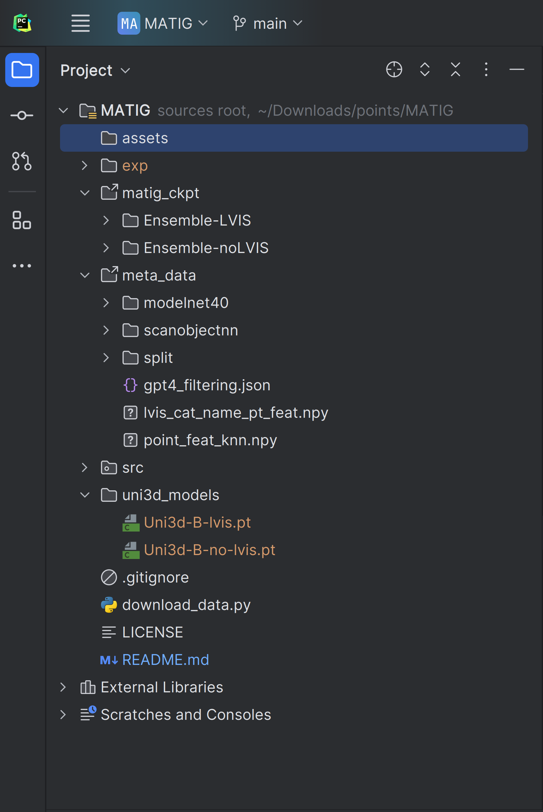

# MATIG
Official code of MATIG.

PITML stands for Point Image Text Machine Learning.

## Installation
We provide two enviroments for running the MATIG inference or (and) training locally
1. Conda 
```
conda create -n MATIG python=3.9
conda activate MATIG 
conda install pytorch==1.12.1 torchvision==0.13.1 torchaudio==0.12.1 cudatoolkit=11.3 -c pytorch
# pip install -U git+https://github.com/NVIDIA/MinkowskiEngine # optional
# conda install -c dglteam/label/cu113 dgl
pip install omegaconf torch_redstone einops tqdm open3d 
# pip install huggingface_hub # if you download the training data
```


2. docker
We also provide a Docker environment to facilitate easy setup and consistent development across different platforms. [baidu disk](https://pan.baidu.com/s/1qPU4x-R1fxJli_qNmfTFKg) (0rar). You can assess the running container with the following command:
```shell
docker run --gpus all --shm-size=64g -v Your_matig_path:/points -it pitml_exp:v1.1 /bin/bash
```
To use the Chamfer Loss functionality, you need to compile it first. Follow the steps below to build the Chamfer Loss module.
```shell
cd Point-MAE/extensions/chamfer_dist
python setup.py install
```
Our Docker container is built on Ubuntu 20.04 with an NVIDIA RTX A6000 GPU（with cuda 11.3 and 12.4， nvidia driver 550.142 , other version may also work）. Please note that inference results may vary slightly when running on different GPUs due to hardware and driver differences.

## inference
To perform model inference, follow these steps:
1. Download the pre-trained model MATIG from [baidu disk](https://pan.baidu.com/s/1lw2L7BCpvp21hlOtbEGv2A)(1n7n) or [google drive](https://drive.google.com/drive/folders/19Xt45384v1vX6PExgD5cVwAPzSefiAUL), and we also provide the training log.
2. Use the following command to perform inference with the downloaded model:
```shell
python src/main.py --config src/configs/MATIG_LVIS.yaml
```
or
```shell
python src/main.py --config src/configs/MATIG_noLVIS.yaml
```

## train
Download the Uni3D base models, including "Ensembled w/o LVIS" and "Ensembled," from [GitHub - baaivision/Uni3D](https://github.com/baaivision/Uni3D). Move the downloaded models to the uni3d_models directory.

You can start training the model using the following command:
```shell
python src/main.py --train --config src/configs/MATIG_LVIS.yaml --trial_name MATIG_LVIS model.name=MATIG model.use_dense=True training.lr=0.0005 training.lr_decay_rate=0.967
```
--config: Path to the configuration file.

--trial_name: name of the trail

## data
We utilize the [OpenShape dataset](https://github.com/Colin97/OpenShape_code) for this project. You can access the dataset via the following link:
[OpenShape Dataset](https://huggingface.co/datasets/OpenShape/openshape-training-data/tree/main). 
Alternatively, you can download the dataset (approximately 200GB) using the following command:
```python
python download_data.py
```

After downloading the dataset, configure the meta_data path and set up symbolic links (soft links"/mnt/data/objaverse-processed/merged_for_training_final/") for the data files as shown below:


